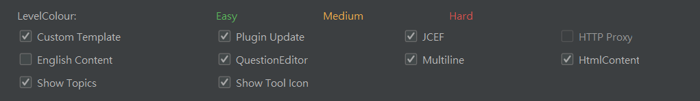

leetcode junit

#tempFilePath
D:\xxxxxxx\leetcode_junit\src\main\java

#codeFileName
P${question.frontendQuestionId}_$!velocityTool.camelCaseName(${question.title})

#codeTemplate
package leetcode.editor.en;

// P${question.frontendQuestionId}_$!velocityTool.camelCaseName(${question.title})

  public class P${question.frontendQuestionId}_$!velocityTool.camelCaseName(${question.title}) {
      
      public static void main(String[] args) {
      
           Solution solution = new P${question.frontendQuestionId}_$!velocityTool.camelCaseName(${question.title})().new Solution();
           
      }
      
      ${question.code}
      
  }

#設定 
 
